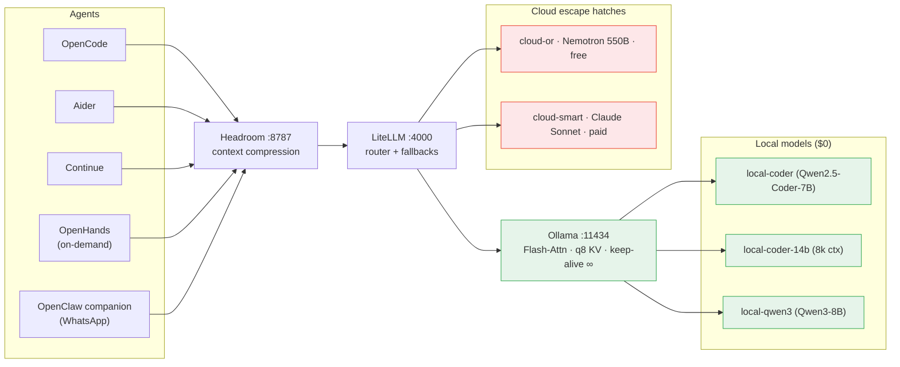
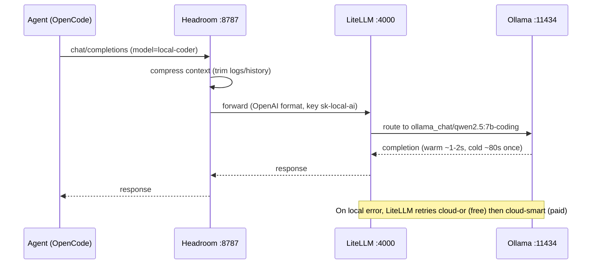
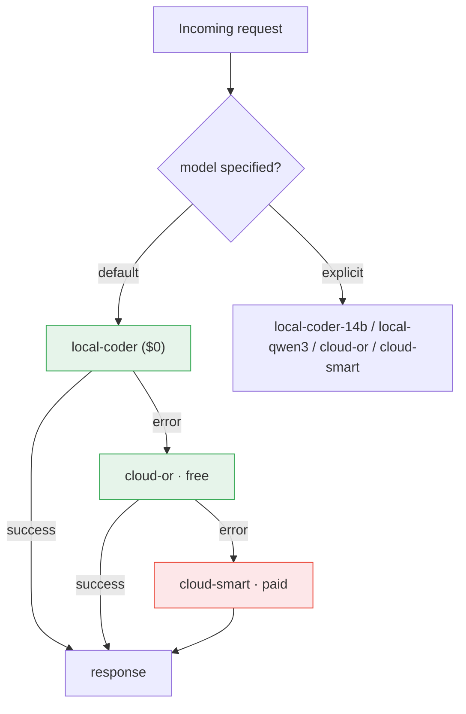
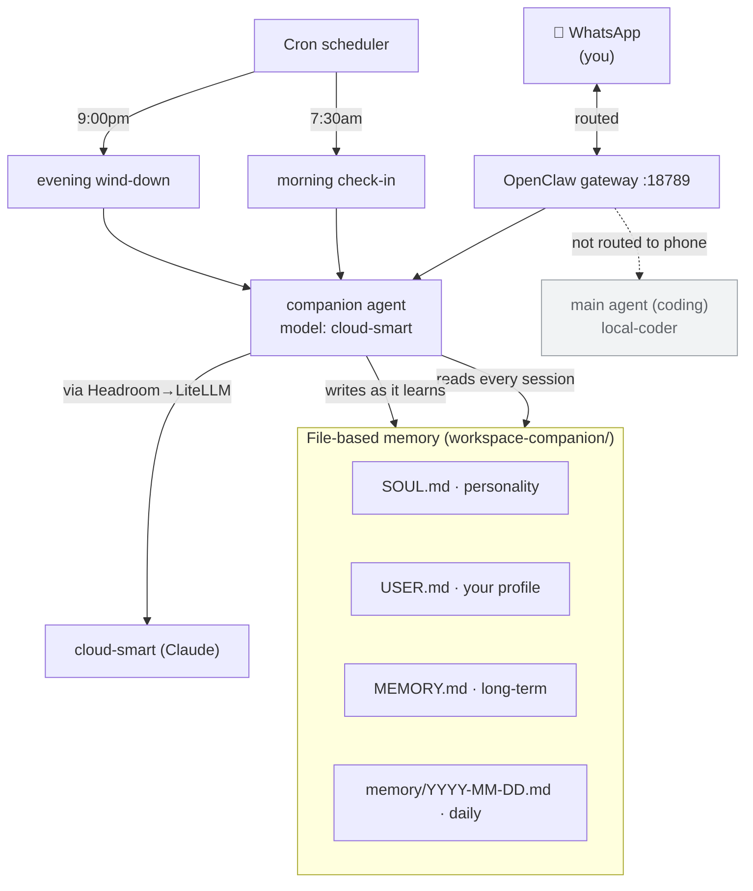
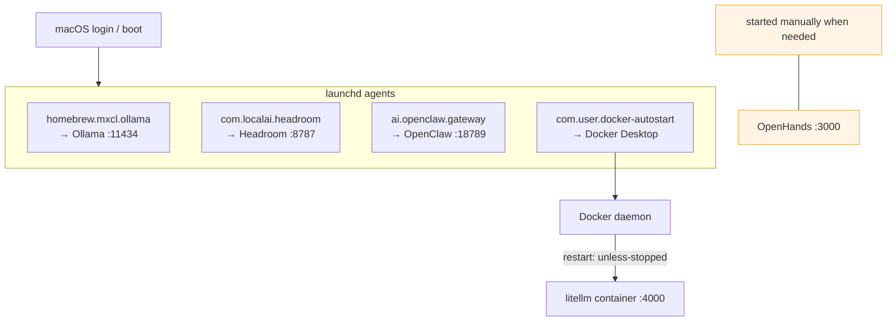

# Architecture

Diagrams for the whole platform. All render natively on GitHub (Mermaid).

- [System topology](#system-topology)
- [Request flow](#request-flow)
- [Model routing & cost ladder](#model-routing--cost-ladder)
- [Personal assistant](#personal-assistant)
- [Deployment & resilience](#deployment--resilience)

---

## System topology

---

## Request flow

A normal coding request, warm path:

---

## Model routing & cost ladder

**Key rule:** fallback is **error-triggered**, not quality-based. Default stays 100 % local/$0; cloud only fires on failure or when you pick it explicitly.

---

## Personal assistant

The companion is a dedicated OpenClaw agent, separate from the coding setup:

Memory is **files**, loaded into every session (incl. scheduled ones) — so the companion stays in-character and context-aware without a live conversation thread.

---

## Deployment & resilience

Everything auto-starts on boot; no manual bring-up:

| Service | Mechanism | Auto-start |
|---|---|---|
| Ollama | Homebrew LaunchAgent | ✅ |
| Headroom | launchd `com.localai.headroom` | ✅ |
| OpenClaw gateway | launchd `ai.openclaw.gateway` | ✅ |
| Docker Desktop | launchd `com.user.docker-autostart` | ✅ |
| LiteLLM | Docker `restart: unless-stopped` | ✅ (with Docker) |
| OpenHands | manual `docker compose up` | ❌ on-demand |

> Note: resilience is wired but, as of last check, hadn't been exercised by a real reboot (uptime was 80+ days). See [operations](operations.md#reboot-resilience).
